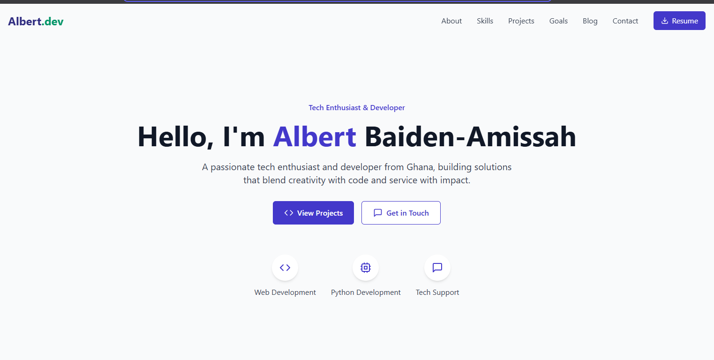
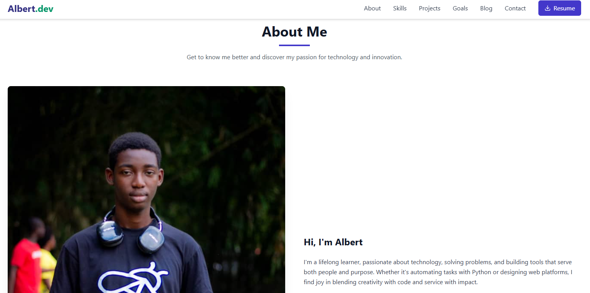
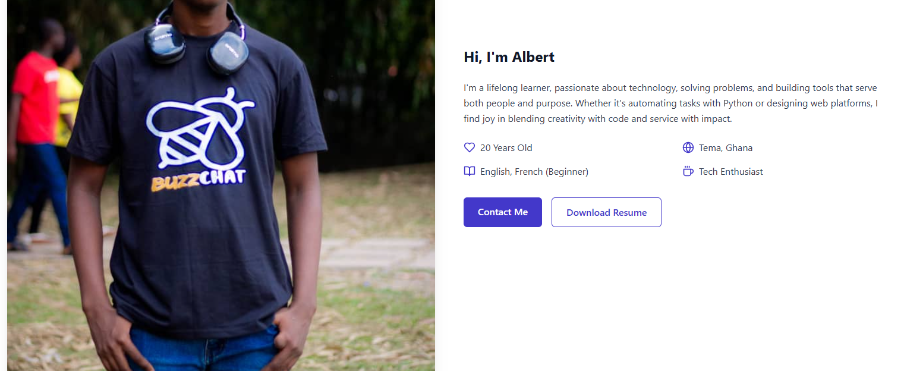
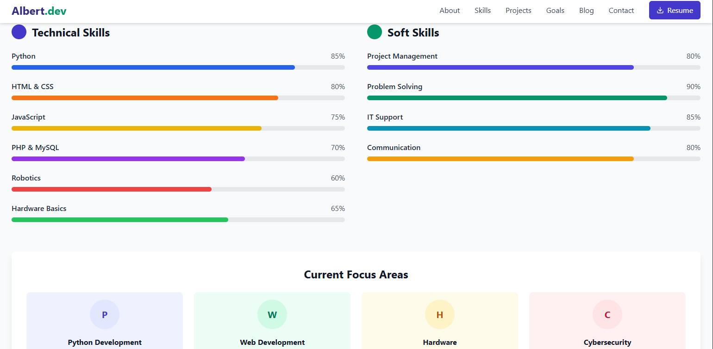
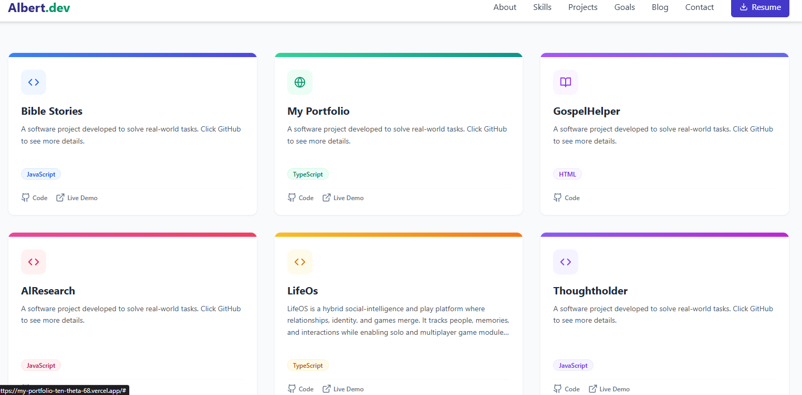
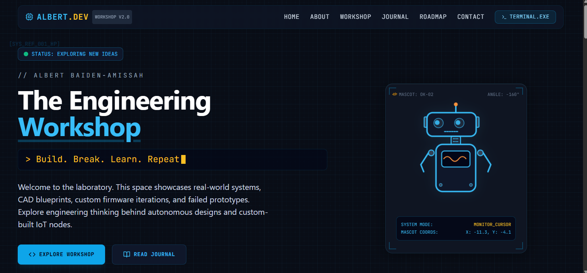
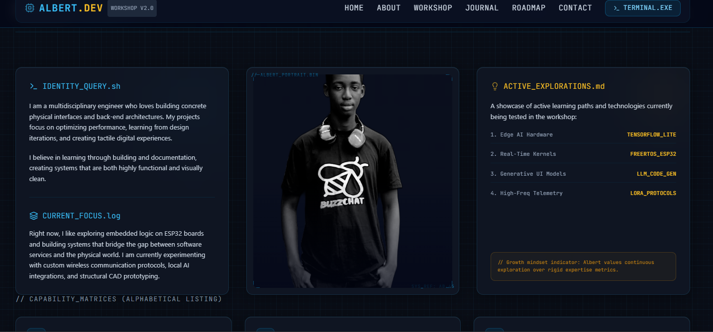
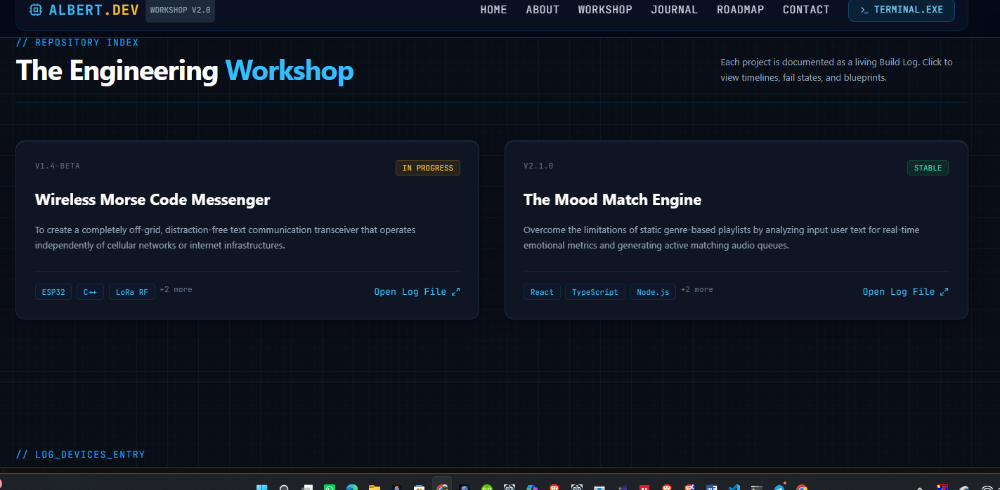
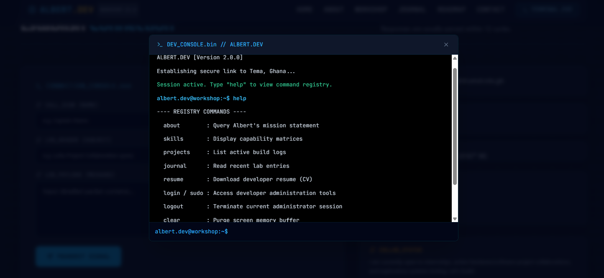

# Rebuilding Albert.dev: From Portfolio Template to Engineering Workshop

*A build log on why I tore down my portfolio and rebuilt it as a lab, not a resume.*

---

## The Problem With "Before"

For a while, my portfolio did what most student portfolios do: it introduced me, listed some skills as percentage bars, and showed a grid of project cards. It worked. It just didn't sound like me.

Here's what it looked like.

### Hero

Clean, readable, standard. "Tech Enthusiast & Developer" is accurate but generic — it could describe thousands of student portfolios. There's no voice here, no hint of how I actually think or build.

### About

The bio is honest — lifelong learner, Python + web platforms, Tema, Ghana, 20 years old. But it reads like a LinkedIn summary rather than something written by someone who documents failed prototypes for fun.

### Skills

Percentage bars are a common pattern, but they invite an obvious question: what does "Python — 85%" actually mean? There's no receipts behind the number — no link to the thing I built that proves it.

### Projects

This is the section that bothered me most. Several cards — Bible Stories, GospelHelper, AIResearch, Thoughtholder — shared the exact same placeholder line: *"A software project developed to solve real-world tasks. Click GitHub to see more details."* Only one project (LifeOS) had a real description. To a visitor, that reads as unfinished, not curated.

---

## The Rebuild: Thinking Like a Workshop, Not a Resume

The fix wasn't just a new color palette. It was a change in framing. Instead of presenting myself as a finished product ("Tech Enthusiast & Developer"), I wanted the site to read like an active lab — a place documenting real builds, real iterations, and real failures, in progress.

That's where the terminal/dev-console identity came from: **Build. Break. Learn. Repeat.** — the same line I use for A3PK Labs. The site had to sound like the person actually behind it.

### Hero

The `STATUS: EXPLORING NEW IDEAS` badge replaces the static tagline with something that feels alive. The typed command-line intro ties directly into my content voice instead of sitting apart from it. The mascot on the right reinforces "workshop" over "resume."

### About

`IDENTITY_QUERY.sh` and `ACTIVE_EXPLORATIONS.md` turn the About section into something that feels native to how I actually work — files, logs, active experiments — rather than a bio paragraph competing with empty whitespace.

### Projects

Reframed as a **Repository Index**. Each project is a Build Log with a version tag, status (`IN PROGRESS` / `STABLE`), a real one-line mission statement, and a tech stack — no more placeholder copy. This is also where the real growth shows: the current live site has a handful of projects with filler text, but my actual build list has grown a lot since — FocusFlow, Builder's Journal, the Biblical Experience Engine, rokai — real systems with real documentation behind them.

### The Console

This is the piece I'm most excited about. A functional `DEV_CONSOLE.bin` with real commands — `about`, `skills`, `projects`, `journal`, `resume`, even a `sudo` login gate — turns the portfolio itself into a small interactive artifact. It says "I build interactive things" far better than any section of prose could.

---

## What Actually Changed

| | Before | After |
|---|---|---|
| **Voice** | "Tech Enthusiast & Developer" | "Build. Break. Learn. Repeat." |
| **About** | Bio paragraph | `IDENTITY_QUERY.sh` — logs, active experiments |
| **Skills** | Percentage bars | Capability matrices tied to real projects |
| **Projects** | Placeholder descriptions on most cards | Build Logs — status, version, real mission statements |
| **Interactivity** | Static cards and bars | Functional terminal with real commands |
| **Overall framing** | A finished product | An active workshop, in progress |

---

## Why This Matters

The percentage bars and placeholder cards weren't *wrong*, exactly — they were just impersonal. Anyone could have that portfolio. The rebuild isn't really about dark mode versus light mode. It's about making the site sound like it was built by someone who documents failure states and half-finished prototypes on purpose, because that's the actual process — not just the polished outcome.

*This site is currently mid-migration — the dark theme above is built and staged, not yet live. I'll update this post with real deployment screenshots once it ships.*
